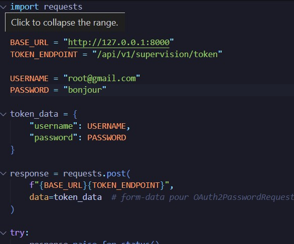
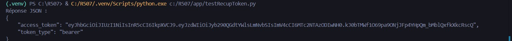
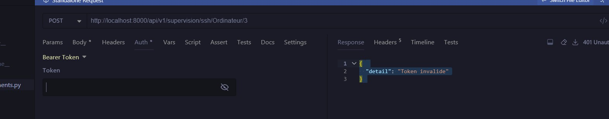
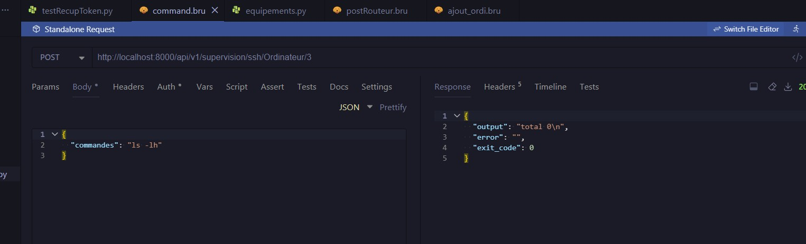

# API de Supervision et Gestion d'Équipements

Cette API REST, développée avec **FastAPI**, permet la gestion d'inventaire d'équipements réseaux (Ordinateurs et Routeurs) et l'exécution de commandes à distance via SSH. Elle intègre un système d'authentification sécurisé via **JWT**.

-----

## 🛠️ Stack Technique & Fonctionnalités

### Stack Technique

  * **Framework :** FastAPI
  * **Base de données :** SQLModel (SQLAlchemy + Pydantic)
  * **Sécurité :** OAuth2 (Password Flow) avec Tokens JWT
  * **Protocole distant :** SSH (via `paramiko`)

### Fonctionnalités

  * **CRUD complet** pour les entités `Ordinateur` et `Routeur`.
  * **Exécution de commandes SSH** à distance sur les équipements enregistrés.
  * **Authentification** des utilisateurs pour sécuriser les actions sensibles.

-----

## 🚀 Installation et Démarrage

### 1\. Prérequis

  * Python 3.9+

### 2\. Installation des dépendances

Installez les dépendances nécessaires (fastapi, uvicorn, sqlmodel, paramiko, etc.) via votre `requirements.txt` :

```bash
pip install -r requirements.txt
```

### 3\. Lancement du serveur

L'API sera accessible par défaut sur `http://127.0.0.1:8000`.

```bash
uvicorn main:app --reload
```

-----

## 📚 Documentation de l'API

Une documentation interactive complète est disponible automatiquement grâce à FastAPI une fois le serveur lancé :

  * **Documentation Swagger UI :** `http://localhost:8000/docs`
  * **Documentation ReDoc :** `http://localhost:8000/redoc`

-----

## 🔐 Guide d'Authentification et d'Utilisation

L'accès aux endpoints sécurisés est géré par des **Bearer Tokens**. Les identifiants Root User sont définis dans le code au démarrage.

### 1\. 🔑 Authentification (Endpoint : `/supervision/token`)

| Étape | Description | Image |
| :--- | :--- | :--- |
| **1.1. Identification Root** | Les identifiants de connexion initiaux. |  |
| **1.2. Récupération du Token** | Utiliser le script de test (`testRecupToken.py`) pour obtenir le jeton JWT. |  |
| **1.3. Copie du Token** | Copier la valeur du `access_token` retournée par le script. |  |
| **1.4. Injection** | Injecter le token dans une variable d'environnement de votre client HTTP (ex: `AUTH_TOKEN` dans Bruno). |  |

### 2\. ➕ Gestion CRUD des Équipements

  * **Ajouter un Ordinateur** : Requête `POST` vers `/supervision/Ordinateur`.
    

  * **Ajouter un Routeur** : Requête `POST` vers `/supervision/Routeur`.
    

### 3\. ⌨️ Actions SSH (Sécurisées)

  * **Faire une requête SSH avec token valide** : Le token est utilisé dans l'en-tête `Authorization` pour autoriser la commande.
    

  * **Token Expiré (24h)** : En cas d'expiration ou de jeton invalide, l'accès est refusé (`401 Unauthorized`).
-----

## 🧪 Tester l'exécution SSH (avec Conteneur Local)

Pour tester la fonctionnalité SSH de l'API contre un serveur SSH réel mais isolé, utilisez un conteneur SSH léger.

### 1\. Lancement du Serveur SSH de Test

Lancez le conteneur en mappant le port **22** de votre hôte au port 22 du conteneur. **Attention :** Le port 22 de l'hôte est souvent utilisé par le système d'exploitation.

```bash
docker run -d --name ssh_test_server -p 22:22 [NOM_DE_VOTRE_IMAGE_SSH]
# Exemple : docker run -d --name ssh_test_server -p 22:22 alpine/sshd
```

### 2\. Enregistrer l'Équipement dans l'API

Après avoir obtenu votre token, utilisez l'endpoint `POST /supervision/Ordinateur` (ou `Routeur`) pour enregistrer ce serveur de test dans l'API :

| Champ | Valeur à utiliser |
| :--- | :--- |
| `ip` | `127.0.0.1` (votre machine hôte) |
| `port` | **`22`** |
| `username` | (Utilisateur configuré dans votre conteneur SSH) |
| `password` | (Mot de passe configuré dans votre conteneur SSH) |

### 3\. Exécuter la Commande SSH

Utilisez ensuite l'endpoint SSH de l'API (`POST /supervision/ssh/Ordinateur/{id}`) pour envoyer la commande de test. L'API se connectera à `127.0.0.1:22`.

-----

## 📊 Modèle de Données

Votre base de données, gérée par **SQLModel**, contient trois tables principales pour organiser les données de l'application :

1.  **`User`** : Gère les identifiants pour l'authentification (login, token).
2.  **`Ordinateur`** : Contient les informations des machines de type poste de travail ou serveur.
3.  **`Routeur`** : Contient les informations des équipements réseau de type routeur.

Chaque table d'équipement (`Ordinateur` et `Routeur`) attend les champs suivants pour la connexion SSH :

* `hostname`
* `ip`
* `username`
* `password`

---
