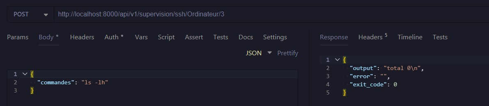

-----

# API de Supervision et Gestion d'Équipements

Cette API REST, développée avec **FastAPI**, permet la gestion d'inventaire d'équipements réseaux (Ordinateurs et Routeurs) et l'exécution de commandes à distance via SSH. Elle intègre un système d'authentification sécurisé via JWT.
---

## 📸 Guide d'utilisation illustré

Cette section détaille les étapes d'utilisation de l'API, de l'authentification à l'exécution de commandes, en se basant sur les images de Bruno et de votre script de test.

### 1. 🔑 Authentification et Obtention du Token

L'accès aux endpoints sécurisés (SSH) nécessite un jeton JWT.

#### 1.1. Identifiants Root par Défaut
Les identifiants de connexion initiaux (Root User) sont définis dans le code :
* **Username/Email :** `root@gmail.com` (ou celui configuré)
* **Password :** bonjour(ou celui configuré)


#### 1.2. Récupération et Injection du Token
Le jeton est récupéré via l'endpoint `/supervision/token`. L'utilisation d'un script (comme `testRecupToken.py`) est recommandée pour automatiser la connexion et l'injection du token dans les variables d'environnement de votre client HTTP (ex: Bruno).


### 2. ➕ Ajout d'Équipements à Superviser

Les requêtes `POST` sont utilisées pour enregistrer les équipements, y compris leurs identifiants SSH pour les connexions futures.

#### 2.1. Ajouter un Ordinateur
Utilisez l'endpoint `/supervision/Ordinateur` et fournissez les informations de connexion et d'identification.


#### 2.2. Ajouter un Routeur
Utilisez l'endpoint `/supervision/Routeur` pour enregistrer un nouveau routeur.


### 3. ⌨️ Exécution de Commandes SSH (Sécurisée)

Une fois le token récupéré (étape 1.2) et l'équipement ajouté (étape 2), vous pouvez exécuter des commandes.

#### 3.1. Requête SSH avec Token Valide
Le token valide est utilisé dans l'en-tête `Authorization: Bearer <TOKEN>` pour autoriser la requête et exécuter la commande à distance.


### 4. 🛑 Gestion de l'Expiration du Token

Le token JWT a une durée de validité limitée (fixée à 24 heures par défaut dans votre configuration).

#### 4.1. Token Expiré ou Invalide
Si le token est invalide ou a expiré, l'accès est refusé, entraînant une erreur `401 Unauthorized`. Vous devez relancer l'étape de récupération du token.



## 🛠️ Stack Technique

  * **Framework :** FastAPI
  * **Base de données :** SQLModel (SQLAlchemy + Pydantic)
  * **Sécurité :** OAuth2 (Password Flow) avec Tokens JWT
  * **Protocole distant :** SSH (via `paramiko` implémenté dans le service SSH)

## 📋 Fonctionnalités

  * **CRUD complet** pour les entités `Ordinateur` et `Routeur`.
  * **Exécution de commandes SSH** à distance sur les équipements enregistrés.
  * **Authentification** des utilisateurs pour sécuriser les actions sensibles (SSH).

## 🚀 Installation et Démarrage

### 1\. Prérequis

  * Python 3.9+
  * Un gestionnaire de paquets (pip)

### 2\. Installation des dépendances

Assurez-vous d'avoir un fichier `requirements.txt` contenant au minimum :

```text
fastapi
uvicorn
sqlmodel
pydantic
python-multipart
python-jose[cryptography]
passlib[bcrypt]
paramiko
```

Installez-les via :

```bash
pip install -r requirements.txt
```

### 3\. Lancement du serveur

```bash
uvicorn main:app --reload
```

*L'API sera accessible par défaut sur `http://127.0.0.1:8000`.*

-----

## 🔐 Authentification

Cette API utilise **OAuth2 avec Bearer Tokens**.

1.  Pour obtenir un token, envoyez une requête POST vers `/supervision/token` avec `username` et `password`.
2.  Le token reçu doit être inclus dans les en-têtes des requêtes sécurisées (SSH) :
      * **Header :** `Authorization`
      * **Value :** `Bearer <votre_token>`

-----

## 📚 Documentation de l'API

Toutes les routes sont préfixées par `/supervision`.

### 1\. Gestion des Ordinateurs

| Méthode | Endpoint | Description |
| :--- | :--- | :--- |
| `GET` | `/Ordinateurs` | Liste tous les ordinateurs. |
| `POST` | `/Ordinateur` | Crée un nouvel ordinateur. |
| `GET` | `/Ordinateur/{host_id}` | Récupère les détails d'un ordinateur spécifique. |
| `PUT` | `/Ordinateur/{host_id}` | Met à jour un ordinateur (Hostname, IP). |
| `DELETE` | `/Ordinateur/{host_id}` | Supprime un ordinateur. |

### 2\. Gestion des Routeurs

| Méthode | Endpoint | Description |
| :--- | :--- | :--- |
| `GET` | `/Routeurs` | Liste tous les routeurs. |
| `POST` | `/Routeur` | Crée un nouveau routeur. |
| `GET` | `/Routeur/{host_id}` | Récupère les détails d'un routeur spécifique. |
| `PUT` | `/Routeur/{host_id}` | Met à jour un routeur (Hostname, IP). |
| `DELETE` | `/Routeur/{host_id}` | Supprime un routeur. |

### 3\. Actions SSH (Sécurisé 🔒)

Ces endpoints nécessitent d'être authentifié. Ils permettent d'envoyer des commandes shell aux équipements.

**Endpoint :** `POST /supervision/ssh/Ordinateur/{id}` ou `/supervision/ssh/Routeur/{id}`

**Corps de la requête (JSON) :**

```json
{
  "commandes": "ls -la"
}
```

**Réponse :**

```json
{
  "output": "résultat de la commande...",
  "error": "",
  "exit_code": 0
}
```

### 4\. Authentification

**Endpoint :** `POST /supervision/token`

Utilise un formulaire `x-www-form-urlencoded` :

  * `username`: (email de l'utilisateur)
  * `password`: (mot de passe)

-----

## 🏗️ Architecture des Données

Voici comment les données circulent lors d'une requête SSH :

L'objet `Ordinateur` ou `Routeur` attend généralement les champs suivants (définis dans `..models`) :

  * `hostname`
  * `ip`
  * `username` (pour la connexion SSH)
  * `password` (pour la connexion SSH)

-----
